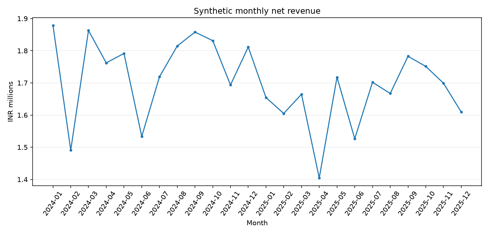
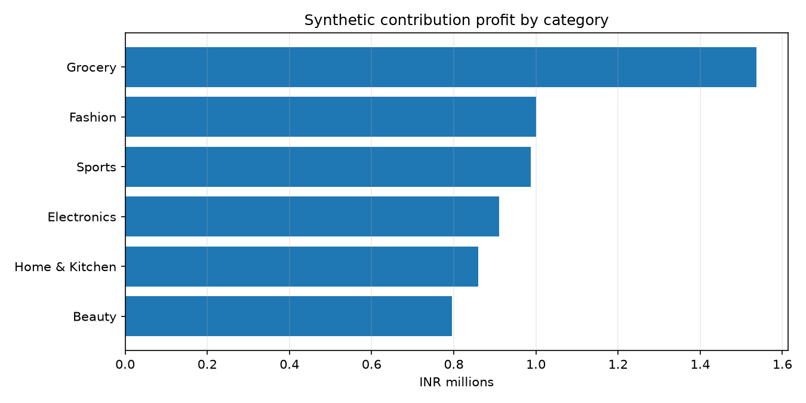

# E-commerce Profitability & Margin Diagnostic

**Reproducible portfolio case study | Python · SQL · Pandas · Matplotlib · Excel · GitHub Actions**

> All data are **synthetic** and generated with a fixed seed. This is not client data, real retailer performance, a causal pricing study or a claim of realized savings. Amounts are fictional INR-denominated model values.

## Business problem

Revenue does not equal profit. This project reconciles discounted sales, refunds, cost of goods sold, outbound shipping and variable payment/channel fees, then identifies the product categories, regions, channels and SKUs contributing to margin pressure.

## Reproducible baseline (12,000 synthetic orders)

| Metric | Result |
|---|---:|
| Orders / lines / products | 12,000 / 18,717 / 120 |
| Net revenue | INR 40,831,958.65 |
| Gross profit / margin | INR 8,741,080.68 / 21.407% |
| Outbound shipping | INR 1,381,671.73 |
| Variable fees | INR 1,268,357.11 |
| Contribution profit / margin | INR 6,091,051.84 / 14.917% |
| Returned units / unit return rate | 1,262 / 5.426% |
| Negative-contribution SKUs | 10 |

The illustrative **5% price-uplift scenario** targets only the 10 negative-contribution SKUs. It increases modeled contribution by **INR 109,237.15 across the complete two-year dataset**, provided demand, returns, discounts and shipping remain unchanged. The scenario is not a forecast, annual savings estimate or guaranteed business outcome.

## Reproduce everything

Python 3.10+ is supported. From the repository root:

```bash
python -m pip install -r requirements.txt
python -m src.generate_data --orders 12000 --seed 2026
python -m src.build_db
python -m src.analyze
python -m pytest -q
```

The generator creates `data/products.csv`, `data/orders.csv` and `data/order_items.csv`. The database builder validates the inputs and creates `outputs/ecommerce.sqlite` locally (intentionally ignored in Git). The analyzer writes the summary, SQL-reconciled segment reports, pricing scenarios and charts into `outputs/`.

## Analysis

- `sql/schema.sql`: relational tables, constraints, indexes and line-level contribution view.
- `sql/analysis.sql`: SQL window functions (`LAG`, `DENSE_RANK`), category profitability, monthly growth, region/channel mix and returns.
- `outputs/summary.json`: reconciled synthetic metrics.
- `outputs/by_category.csv`, `by_region.csv`, `by_channel.csv`, `by_sku.csv`: segmentation.
- `outputs/loss_making_skus.csv`: SKUs with negative aggregate contribution.
- `outputs/monthly_trends.csv`: monthly revenue and month-over-month growth.
- `outputs/pricing_sensitivity.csv`: 0%, 3%, 5%, 8% and 10% constant-volume scenarios.
- `outputs/monthly_revenue.png` and `category_contribution.png`: charts.
- `excel/Pricing_Sensitivity_Model.xlsx`: an Excel model with explicit baseline inputs and formula-driven pricing scenarios.

## Charts





## Reconciliation and automated quality checks

The same `line_profitability` SQLite view feeds both Python analysis and SQL reporting. Tests cover reproducibility, shipping allocation, financial reconciliation, returns, database constraints, pricing scenario consistency and output serialization. GitHub Actions regenerates the data, rebuilds the database, runs the analyzer and executes the test suite. On passing main-branch runs, it commits reproducible synthetic CSVs and report assets.

## Financial definitions and limitations

**Gross profit = retained revenue − retained COGS. Contribution profit = gross profit − original outbound shipping − variable payment/channel fees.** Returned units are fully refunded and restocked in this simplified model. Shipping incurred before a return remains a cost. Fees apply only to retained revenue. Fixed overhead, marketing, tax, return shipping and damaged-return losses are excluded, so contribution profit must not be described as accounting net profit.

The pricing sensitivity holds demand and returns constant and increases variable fees as retained revenue rises. Price elasticity, conversion and competitive responses are not modeled. The Excel workbook is a snapshot of the default synthetic baseline and requires manual input refresh after regenerating a different dataset.

See [`docs/DATA_DICTIONARY.md`](docs/DATA_DICTIONARY.md), [`docs/INTERVIEW_GUIDE.md`](docs/INTERVIEW_GUIDE.md), [`data/README.md`](data/README.md) and [`excel/README.md`](excel/README.md) for detailed notes.

## Resume-ready wording

Built a reproducible Python and SQL profitability pipeline over 12,000 **synthetic** orders, reconciling refunds, product costs, shipping and variable fees; identified 10 negative-contribution SKUs and modeled transparent Excel pricing scenarios.
